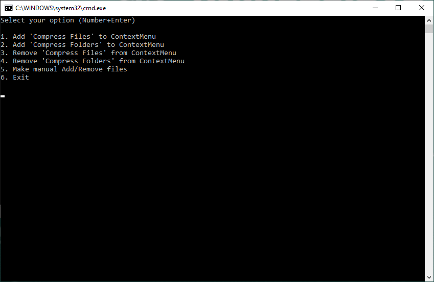
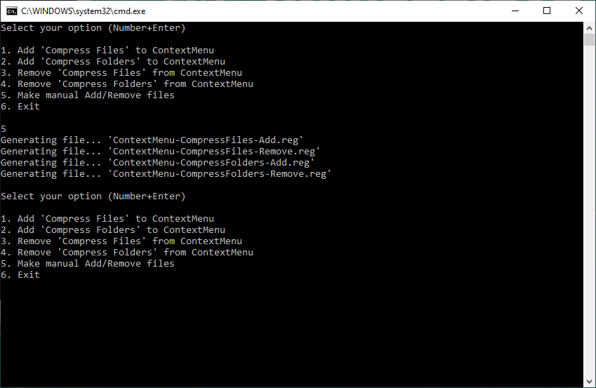
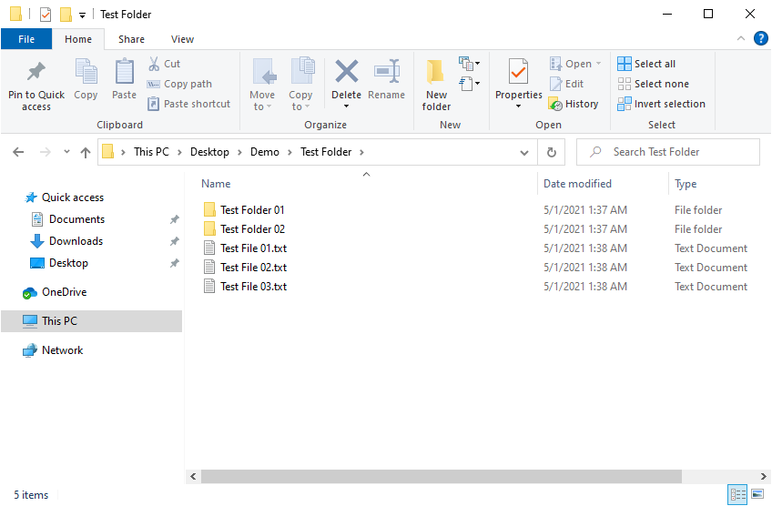
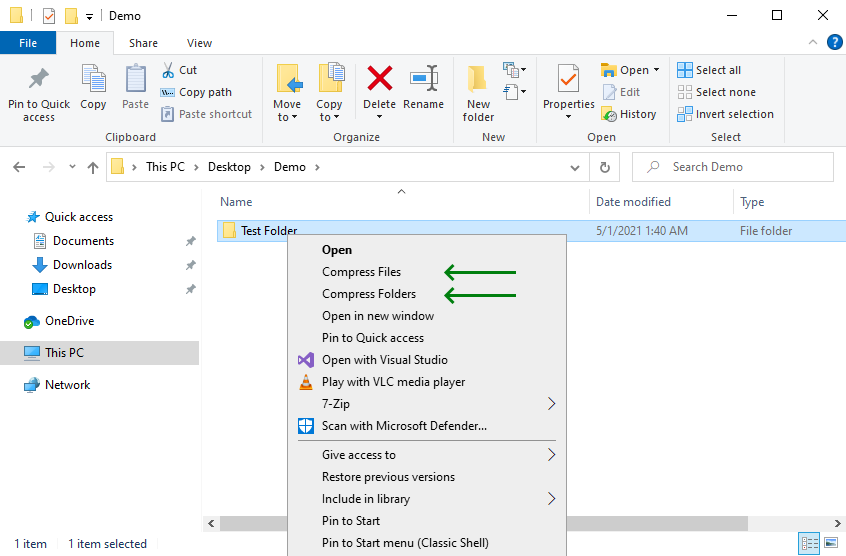
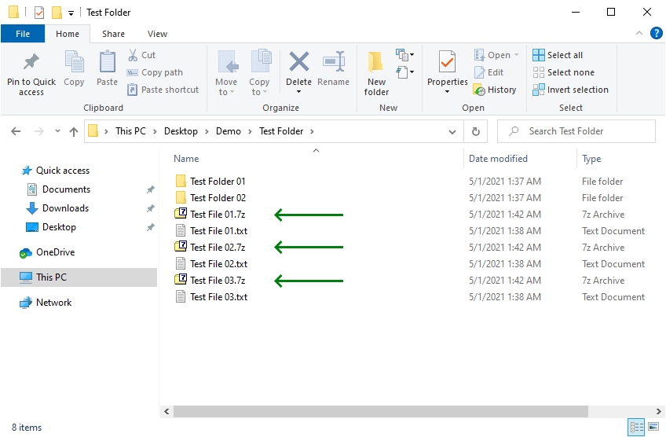
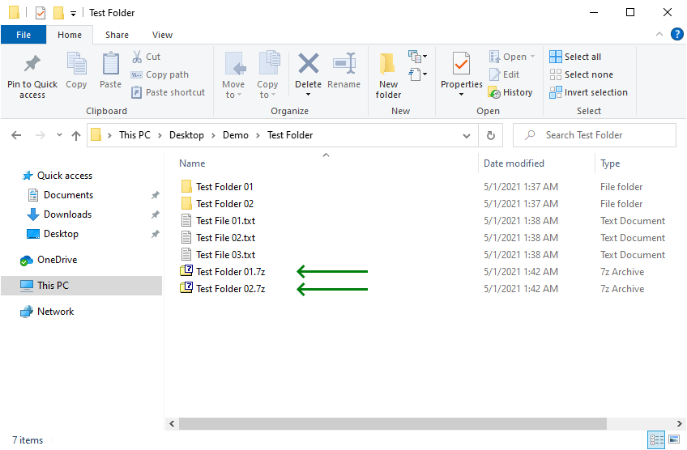

# 7z Compress ContextMenu

A 7-Zip batchfile plugin to compress contents of given folder into **individual** '.7z' files.

&nbsp;

### Screenshots

| Setup Menues      | Make manual files |
|-------------------|-------------------|
|  |  |

| Demo              |  Context Menu     |
|-------------------|-------------------|
|  |  |

| Compress Files    | Compress Folders  |
|-------------------|-------------------|
|  |  |

### Setup & Requirements

Just doble-click 'Setup.bat' to manage the desired entries on windows folders context-menu.  
The context-menu entries are managed throught the windows registry, so you will be asked to accept those changes first.

| Command | Description |
|---------|-------------|
| `Menu Option #1` | Adds 'Compress Files' to folders context-menu. |
| `Menu Option #2` | Adds 'Compress Folders' to folders context-menu. |
| `Menu Option #3` | Removes 'Compress Files' from folders context-menu. |
| `Menu Option #4` | Removes 'Compress Folders' from folders context-menu. |
| `Menu Option #5` | Makes '.reg' files to manually add/remove entries on folders context-menu. |
| `Menu Option #6` | Exit. |

### Limitations

- A working installation of 7-Zip is needed.
- Currently the only accepted instalation path is: `C:\Program Files\7-Zip\7z.exe`

### Version History

v1.0 (2023.06.07) - Initial release.  
v1.1 (2023.06.28) - Update electronic diagrams, adding case 3D model.  

&nbsp;

This source code is licensed under GPL v3.0  
Please send me your feedback about this project: andres.garcia.alves@gmail.com
